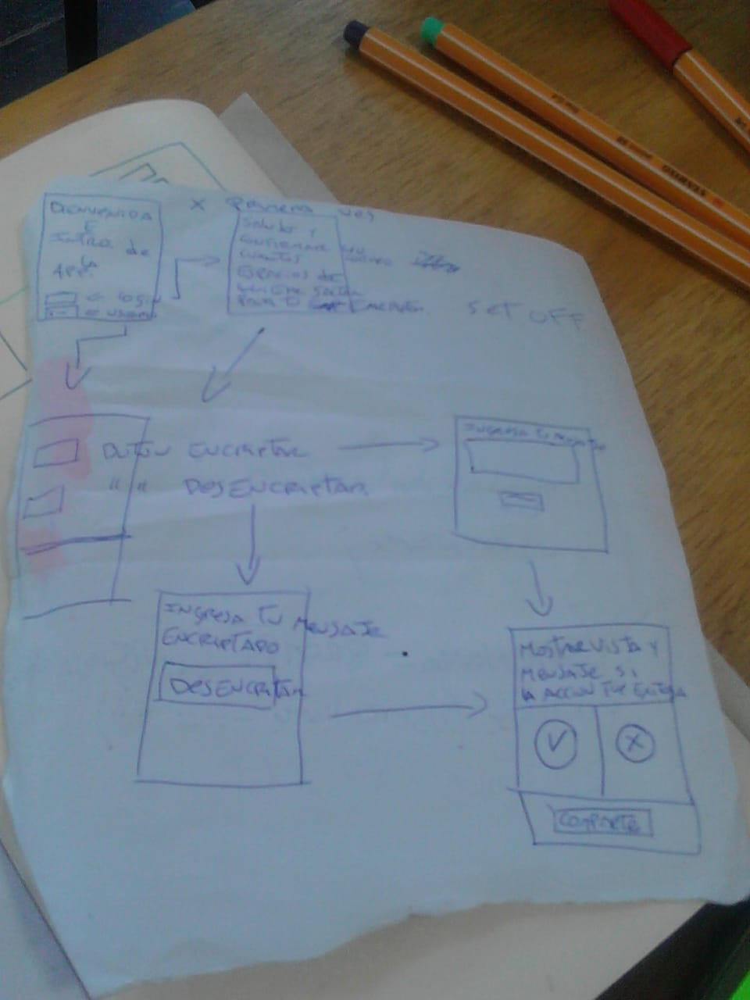
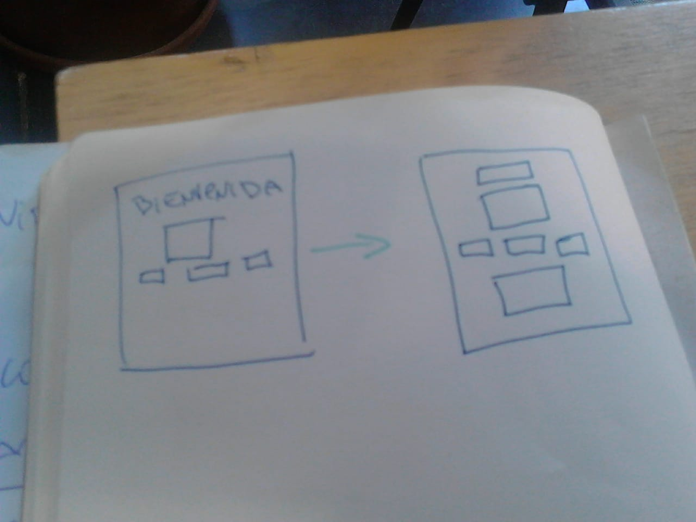

# Hermetik
 
Es una App. que se creo a traves de las necesidades de la fundación **APOYO INDIGENA** para enviar mensajes importantes de forma segura dentro y fuera de la organizacion, esta fundación ayuda a las comunidades indigenas en latinoamerica para revindicar sus derechos, brindan apoyo de forma psicosocial y legal en zonas de conflicto, en chile estan brindando apoyo en el conflicto mapuche su sede esta en la Araucania

**APOYO INDIGENA** a comienzos del 2018 presento fugas de información clasificada, como: 
1. Reubicacion de victimas en otras comunidades
2. Donaciones para ayuda a la fundación.
3. Documentacion legal para los jucios. 

Lo cual desancadeno en que:
- Las victimas reubicadas fueron hostigadas nuevamente.
- Las donaciones para la fundación fueron robadas.
- Desapariciones de documentación legal justo en juicios claves.   

## Soluciones para la problematica

En variadas reuniones con los organizadores de la funcacion **APOYO INDIGENA** llegamos a la solución de encriptar los mensajes, pero nos encontramos con una barrera generacional y digital con las personas que trabajaban para la organización. Aquello nos llevo a diseñar una app amigable con el usuario, mas una charla inductora para los trabajadores que tendran que ocupar esta nueva herramienta.

## Diseño
Se ocuparon tonos grises para el background con la finalidad de generar confianza y flexibilidad para obtener un formato conservador y amigable. 

https://pickaso.com/2017/consejos-color-tipografia-apps

## Proceso de diseño 1

## Proceso de diseño 2 
aqui simplificamos las vistas

## Planificacion

https://trello.com/b/pmWIfTGf/proyecto-n1-cifrado-cesar

